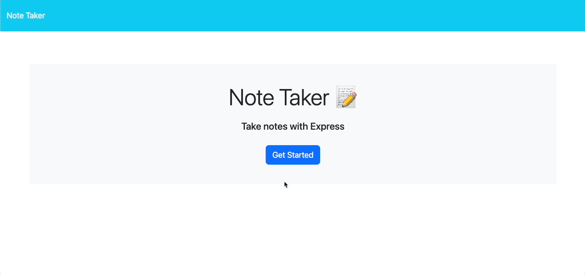

# Note Taker Application

Welcome to the Note Taker App! This user-friendly application is designed to take user input and save notes that can be edited as necessary or deleted when they are no longer needed.

## Usage
- Enter a title and text for your note and click the save button to save it to the list 
- When you are ready to delete a note, click the trash can icon next to the note you wish to delete
- Revisit previous notes by clicking on the title of the note you wish to view.

[Try it out here!](https://pure-plateau-06759-17795068f1d2.herokuapp.com/)

## Contributors
Adam Brannon

[Check out my repo](https://github.com/adam-brannon09)

[Email Me](mailto:adam.brannon09@icloud.com)

## Feedback and Support

If you encounter any issues while using the Note Taker Application or have any suggestions for improvement, please [open an issue](https://github.com/adam-brannon09/readme_generator/issues) on the GitHub repository. I appreciate your feedback and will address any concerns as soon as possible.

## License

The Note Taker Application is released under the [MIT License](https://opensource.org/licenses/MIT). You are free to use, modify, and distribute this application as per the terms of this license.

    

